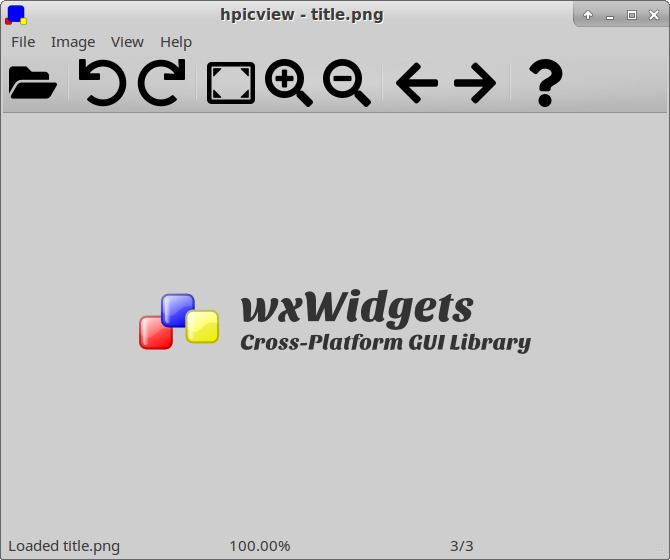

# hpicview

Hermann's picture viewer

This simple picture viewer was written in the spirit of IrfanView, gpicview and Windows 7's picture viewer.  
All of them can rotate JPEG files losslessly, but only Windows 7's picture viewer offers a one-click solution.

